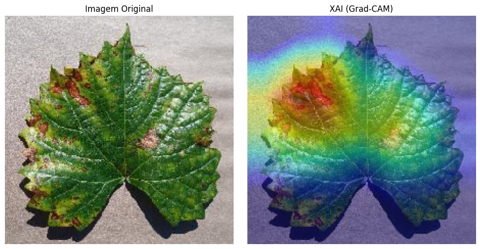

# Classificação de Doenças em Plantas com Deep Learning e XAI

Este repositório apresenta um miniprojeto acadêmico desenvolvido para a disciplina de **Inteligência Artificial (2026.1)** na Universidade Católica de Pernambuco (UNICAP). O projeto propõe um sistema de classificação automatizada de doenças em folhas de plantas utilizando Redes Neurais Convolucionais (CNN) e técnicas de Inteligência Artificial Explicável (XAI).

---

## 📖 Fundamentação Teórica
Este projeto é fundamentado no seguinte artigo científico:
> **Título:** *Improving Plant Disease Classification With Deep-Learning-Based Prediction Model Using Explainable Artificial Intelligence*  
> **Autores:** Natasha Nigar, Hafiz Muhammad Faisal, Muhammad Umer, Olukayode Oki, Manappattukunnel Lukose Joseph  
> **Periódico:** IEEE Access (Volume 12, 2024)  
> **DOI:** [10.1109/ACCESS.2024.3428553](https://doi.org/10.1109/ACCESS.2024.3428553)

---

## 🚀 Diferenciais Técnicos
O projeto incorpora as seguintes contribuições em relação ao artigo de referência:
1. **Integração do EfficientNetB4:** Adição de um modelo de arquitetura de ponta ao conjunto de modelos analisados, permitindo comparação entre a precisão preditiva e o custo computacional.
2. **Implementação de Grad-CAM:** Adoção do método Grad-CAM como técnica de explicabilidade, proporcionando visualização determinística das regiões da folha que influenciaram a tomada de decisão da rede neural.

---

## 📊 Base de Dados
O projeto utiliza o **New Plant Diseases Dataset**, disponível publicamente na plataforma Kaggle.
*   **Total de Imagens:** Aproximadamente 87.000
*   **Classes:** 38 categorias (estados de saúde e doenças identificadas)
*   **Espécies Botânicas:** 14 tipos de plantas (ex: Tomate, Batata, Maçã, Milho)
*   **Particionamento:** 80% destinado ao treinamento, 20% destinado à validação

---

## 🛠️ Tecnologias e Metodologia
O desenvolvimento foi realizado em **Python**, utilizando os frameworks **TensorFlow** e **Keras**.

### Procedimentos de Implementação:
1. **Pré-processamento de Dados:** Redimensionamento das imagens para 224x224 pixels e normalização dos valores de intensidade.
2. **Aumento de Dados:** Aplicação de transformações incluindo rotação (±40°), deslocamento horizontal/vertical (20%), deformação por cisalhamento (20%), ampliação (20%) e espelhamento horizontal.
3. **Transfer Learning em Duas Etapas:**
    - **Etapa 1 (Aquecimento):** 3 épocas com modelo base congelado, estabilizando a última camada de rede.
    - **Etapa 2 (Ajuste Fino):** 5 épocas com modelo base destravado, utilizando taxa de aprendizado reduzida (1e-4).
4. **Treinamento:** Utilização do otimizador Adam, função de perda Categorical Crossentropy e regularização por Dropout (0.5).
5. **Explicabilidade (XAI):** Geração de mapas de ativação através do método Grad-CAM para validação visual das regiões de interesse identificadas pela rede neural.

---

## 📈 Resultados e Análise de Explicabilidade
A figura a seguir demonstra os resultados obtidos com a implementação da técnica Grad-CAM, onde as regiões afetadas por doenças são precisamente identificadas e destacadas:

---

## ⚙️ Instruções de Execução
1. Efetuar o download do arquivo `MiniProjetoipynb.ipynb`.
2. Abrir o arquivo no **Google Colab**.
3. Ativar a **GPU T4** (menu: Ambiente de Execução > Alterar tipo de ambiente de execução).
4. Configurar o token de API do Kaggle para o download automático da base de dados.
5. Executar as células do notebook sequencialmente.

---

## 🎓 Informações Institucionais
**Instituição:** Universidade Católica de Pernambuco (UNICAP)  
**Disciplina:** Inteligência Artificial (2026.1)  
**Orientador:** Francisco Madeiro